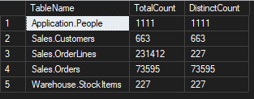
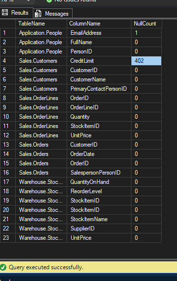
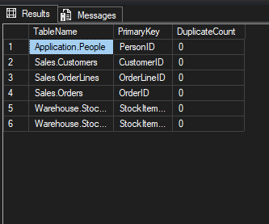
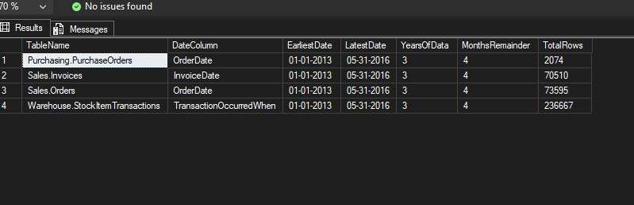
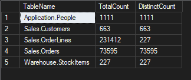

# Project 1: Data Profiling & Quality Assessment

## Overview
This project explores and validates the Microsoft Wide World Importers (WWI) database using SQL Server.

Before starting sales or customer analysis, I first checked the quality and structure of the data to make sure the dataset was reliable for reporting and dashboard creation.

---

## Goals of the Analysis
The main goals were to:

- Understand the size of the dataset
- Check for missing values in important columns
- Identify duplicate primary keys
- Review the time period covered by the data
- Understand the number of unique customers, orders, and products

---

## Tools Used
- SQL Server
- SQL Server Management Studio (SSMS)
- WideWorldImporters Sample Database

---

## Tables Used
The analysis focused on these main tables:

- `Sales.Customers`
- `Sales.Orders`
- `Sales.OrderLines`
- `Sales.Invoices`
- `Warehouse.StockItems`
- `Warehouse.StockItemHoldings`
- `Application.People`
- `Warehouse.StockItemTransactions`
- `Purchasing.PurchaseOrders`

---

## SQL Skills Demonstrated
- Aggregate functions (`COUNT`, `MIN`, `MAX`)
- `CASE WHEN`
- `GROUP BY`
- `HAVING`
- `UNION ALL`
- Null checks
- Duplicate checks
- Distinct counts
- Date analysis

---

## Business Questions Answered

### 1. How large is the dataset?
Checked row counts across key business tables to understand transaction volume and dataset scale.

### 2. Are there missing values in important columns?
Reviewed critical business columns to identify null values that could affect analysis.

### 3. Are there duplicate primary keys?
Validated that important ID columns such as `CustomerID` and `OrderID` were unique.

### 4. What time period does the data cover?
Checked the earliest and latest transaction dates across operational tables.

### 5. How many unique entities exist in each table?
Compared total records and distinct IDs to better understand the structure of the dataset.

---

## Key Findings

- The dataset contains over 73,000 customer orders and 231,000 order line records.
- Most important business columns contain no missing values.
- No duplicate primary keys were found in any core table.
- All major tables cover the same period from January 2013 to May 2016.
- `Sales.OrderLines` contains repeated products across many orders, which is expected for transaction-level sales data.
- Overall, the dataset is clean and suitable for further sales and customer analysis.

---

## File
- `Project1_DataProfiling.sql`

---

## Related Projects
- [WWI Revenue & Customer Segmentation Dashboard (Power BI)](https://github.com/nive710/WWI-Power-BI-Portfolio)

---

## Author
**Nivethitha Selvaraj**  
Data Analyst | Power BI | SQL | Vancouver, Canada
[Connect on Linkedin](https://www.linkedin.com/in/nivethitha-s/)
