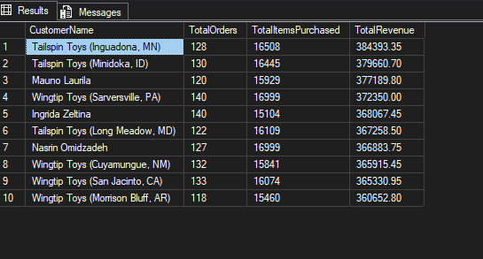
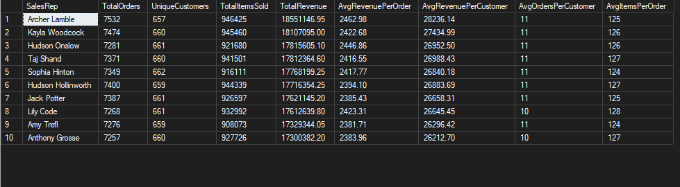
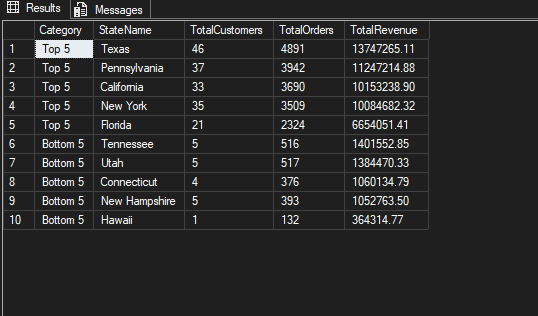

# Project 2: Sales Performance Analysis

## Overview
This project analyzes sales performance in the Microsoft Wide World Importers (WWI) database using SQL Server.

The analysis focuses on customer revenue, sales representative performance, and regional sales trends to better understand the key drivers of business performance.

---

## Goals of the Analysis
The main goals were to:

- Identify the highest revenue-generating customers
- Evaluate sales representative performance using multiple KPIs
- Compare regional sales performance across states
- Understand how customers, orders, and revenue are distributed

---

## Tools Used
- SQL Server
- SQL Server Management Studio (SSMS)
- WideWorldImporters Sample Database

---

## Tables Used
The analysis focused on these main tables:

- `Sales.Customers`
- `Sales.Orders`
- `Sales.OrderLines`
- `Sales.Invoices`
- `Sales.InvoiceLines`
- `Application.People`
- `Application.Cities`
- `Application.StateProvinces`

---

## SQL Skills Demonstrated
- Joins
- Aggregate functions (`SUM`, `COUNT`, `AVG`)
- `GROUP BY`
- `ORDER BY`
- Common Table Expressions (CTEs)
- Window functions (`RANK`)
- KPI calculations
- View creation
- Revenue analysis

---

## Business Questions Answered

### 1. Who are the highest value customers?

Analyzed top customers based on total revenue, order count, and items purchased.

---

### 2. How are sales reps performing?

Created a reusable SQL view to evaluate sales reps using revenue, orders handled, customer count, and average order metrics.

---

### 3. Which states generate the highest and lowest revenue?

Compared top and bottom performing states using customer count, order volume, and revenue metrics.

---

## Key Findings

- Tailspin Toys and Wingtip Toys appear frequently among the top revenue-generating customers.
- Revenue among the top 10 customers is closely distributed, suggesting WWI is not heavily dependent on a single customer.
- Sales performance is relatively balanced across all sales representatives.
- Average orders per customer remain consistent across reps, indicating strong repeat purchasing behaviour.
- Texas generated the highest revenue among all states due to strong customer and order volume.
- Lower-performing states generally had fewer customers and transactions, leading to lower revenue.

---

## File
- `Project2_SalesPerformance.sql`

---

## Related Projects
- WWI Revenue & Customer Segmentation Dashboard (Power BI)

---

## Author
**Nivethitha Selvaraj**  
Data Analyst | Power BI | SQL | Vancouver, Canada

[Connect on LinkedIn](https://www.linkedin.com/in/nivethitha-s/)
