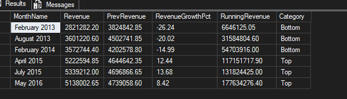
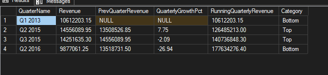

# Project 4: Revenue Trend Analysis

## Overview
This project analyzes revenue trends in the Microsoft Wide World Importers (WWI) database using SQL Server.

The analysis focuses on monthly and quarterly revenue performance to identify growth patterns, seasonal fluctuations, high-performing periods, and revenue slowdowns over time.

---

## Goals of the Analysis
The main goals were to:

- Analyze monthly revenue trends over time
- Identify the best and worst performing months
- Measure month-over-month revenue growth
- Analyze quarterly revenue performance
- Identify long-term business growth patterns
- Detect seasonal revenue fluctuations

---

## Tools Used
- SQL Server
- SQL Server Management Studio (SSMS)
- WideWorldImporters Sample Database

---

## Tables Used
The analysis focused on these main tables:

- `Sales.Orders`
- `Sales.OrderLines`

---

## SQL Skills Demonstrated
- Common Table Expressions (CTEs)
- Window functions (`LAG`, `ROW_NUMBER`)
- Running totals
- Time-series analysis
- Revenue growth calculations
- Ranking analysis
- Aggregate functions (`SUM`)
- Date functions
- Trend analysis

---

## Business Questions Answered

### 1. How has monthly revenue changed over time, and which months performed the best and worst?

Analyzed monthly revenue trends using growth percentages, running revenue totals, and ranking logic to identify the strongest and weakest performing months.

---

### 2. How has quarterly revenue changed over time, and which quarters performed the best and worst?

Analyzed quarterly revenue performance and quarterly growth trends to identify broader business growth patterns over time.

---

## Key Findings

- February appeared multiple times among the lowest-performing months, indicating recurring early-year revenue slowdowns.
- July 2015 recorded the highest monthly revenue, followed closely by April 2015 and May 2016.
- Top-performing months showed strong positive growth, while bottom-performing months experienced significant declines.
- Q2 and Q3 of 2015 were the strongest performing quarters across the dataset.
- Revenue consistently recovered after lower-performing periods, indicating stable long-term business growth.
- Running revenue trends showed overall business expansion despite short-term fluctuations.

---

## SQL File
[Project4_RevenueTrendAnalysis.sql](https://github.com/nive710/WWI-SQL-Portfolio/blob/main/04_Revenue_Trend_Analysis/Project4_RevenueTrendAnalysis.sql)

---

## Related Projects
- [WWI Revenue & Customer Segmentation Dashboard (Power BI)](https://github.com/nive710/WWI-Power-BI-Portfolio)

---

## Author
**Nivethitha Selvaraj**  
Data Analyst | Power BI | SQL | Vancouver, Canada

[Connect on LinkedIn](https://www.linkedin.com/in/nivethitha-s/)
